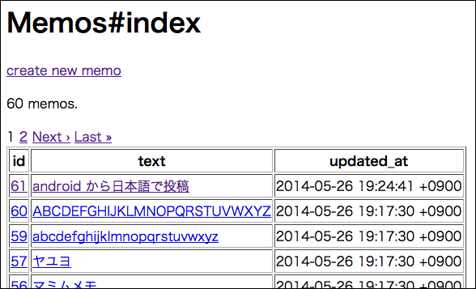

 Memo Stack (Rails)
====================

画面写真
--------

doc/screenshots 以下に画面写真があります。




キーワード
----------

* Rails
* Grape
* Web API
* RSpec
* Capybara

概要
----

サーバー(__Rails__)とクライアント(__Android__)の連携の習作です。  
Web API の構築と各種テストを経験することが目的です。  

Web API の構築には Grape を使いました。

私はこれまでテストの経験は model だけでしたので、今回は features, requests, api などにも取り組みました。

プログラムの挙動
----------------

* シンプルなテキストメモの投稿/閲覧/削除サービスのサーバーです。
* `index`, `new/create`, `show`, `destroy` がありますが、`edit/update` がありません。

工夫したこと
------------

* develop/test/production 環境で DB が異なるので、`TimeZone` はデータベースに合わせるように初期化処理を条件分岐しました。
* production の `secret_key_base` は、Git の管理外の領域に保存させました。
* Grape からのレスポンスが Android 端末で文字化けしないように `Content-Type` を調整しました。
* 実際にクライアント端末のアプリ(memo-stack-android)を作成して、レスポンスに含める項目をサーバー側だけでなくクライアント端末の立場でも考慮しました。

インストール
------------

Rails.root に `gitignore` というディレクトリを作成してください。  
(`config/secrets.yml` で直接指定している箇所があるため)

```
$ git clone https://github.com/murakamit/memo-stack-rails
$ cd memo-stack-rails
$ mkdir gitignore
$ bundle install
$ bundle exec rspec
```

謝辞
----

ありがとうございます。

rspec/rspec-rails · GitHub  
https://github.com/rspec/rspec-rails

jnicklas/capybara · GitHub  
https://github.com/jnicklas/capybara

intridea/grape · GitHub  
https://github.com/intridea/grape

amatsuda/kaminari · GitHub  
https://github.com/amatsuda/kaminari

動作確認
--------

* Mac OS X 10.8.5
* Ruby 2.1.2p95
* Rails 4.1.1
* RSpec 2.14.8
* SQLite3 3.7.12
* WEBrick 1.3.1

- - - - - - - - - - - - - - - - - - - -
Author: 村上悌治(Teiji MURAKAMI)  
GitHub: https://github.com/murakamit/memo-stack-rails
